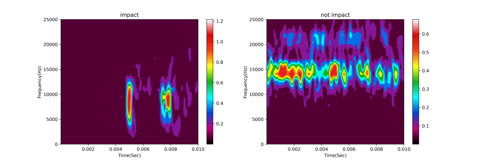
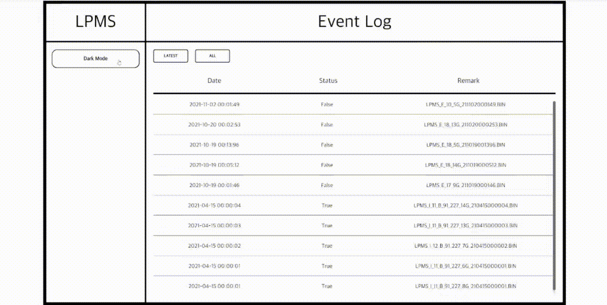

인하대학교 탄소 중립 아카데미 프로젝트

윈자로 내부에서 lpms(loose part monitoring system)를 지능화하는 프로젝트를 진행하였습니다.

신호를 stft(short time fourier transform) 변환시 충격/비충격 데이터를 분류할 수 있습니다. 이를 ai를 활용하여 자동화 하였습니다. 

이 프로젝트에서 저는 신호 처리 및 ai 파트를 맡았습니다.

시연 영상

