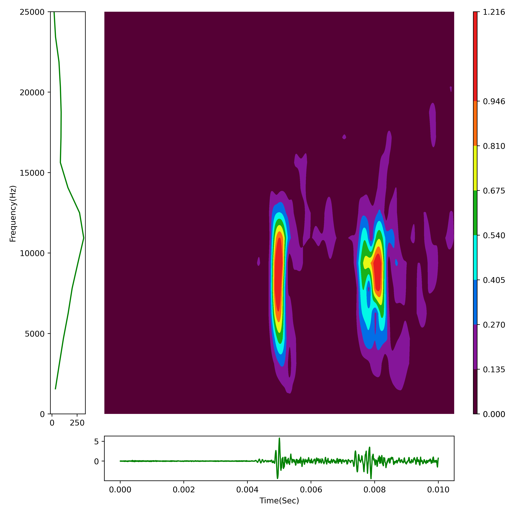

서버에 최종적으로 제공되는 파일들입니다.

```fourier_lib.py```: 프로그램을 실행하기 위한 class를 정의해 놓은 파일입니다.   
```fft.py```: 입력받은 데이터를 fft 변환한 결과를 저장합니다.   
```stft.py```: 입력받은 데이터를 stft 변환하여 생성한 이미지를 저장합니다. 예시는 다음과 같습니다.   

```ai.py```입력받은 데이터가 충격인지 비충격인지 여부와 비충격 데이터일 확률(원래는 충격 데이터일 확률을 출력하려 했으나 labeling 실수를 하여 반대가 되었습니다ㅜ)을 출력합니다.   
```50_0.013085763479087876.pth```: ai의 weight 입니다.   

jupyter파일은 위 프로그램을 위한 연습장입니다.