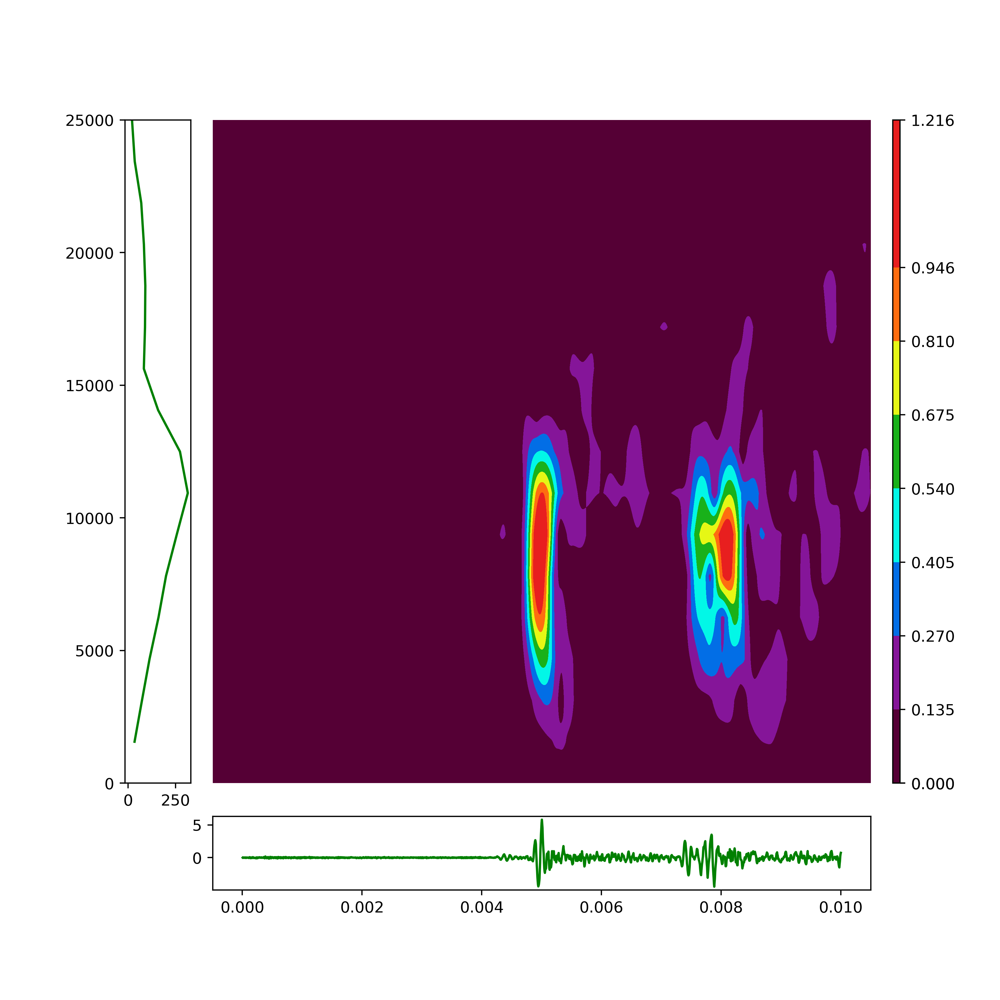

```stft.py```: 서버에 최종적으로 제공되는 프로그램입니다. 다음과 같은 일을 합니다.
1. 입력받은 데이터를 fft 변환한 결과를 저장합니다.

2. 입력받은 데이터를 stft 변환하여 생성한 이미지를 저장합니다. 예시는 다음과 같습니다.


3. 입력받은 데이터가 충격인지 비충격인지 여부와 충격 데이터일 확률을 출력합니다.

```42_3.587652378297776e-05.pth```: ai의 weight 입니다.

jupyter파일은 위 프로그램을 위한 연습장입니다.